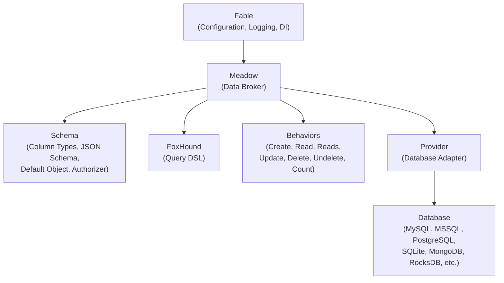
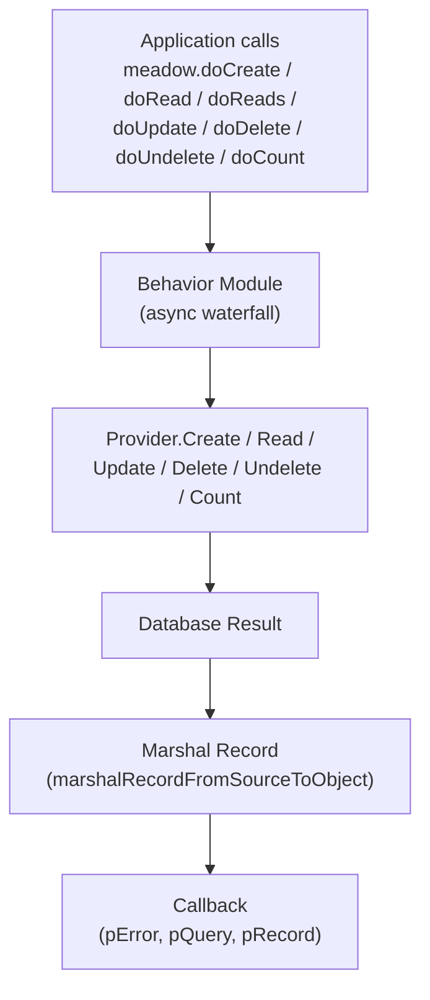
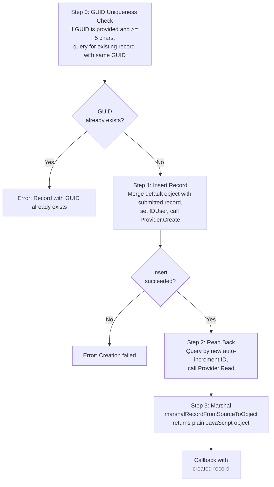
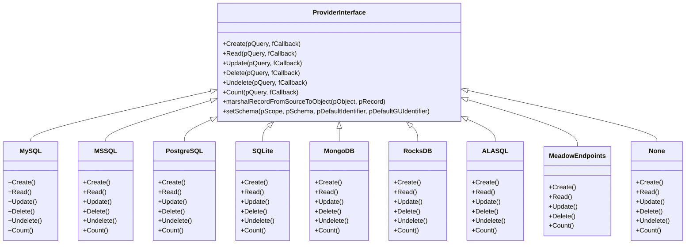
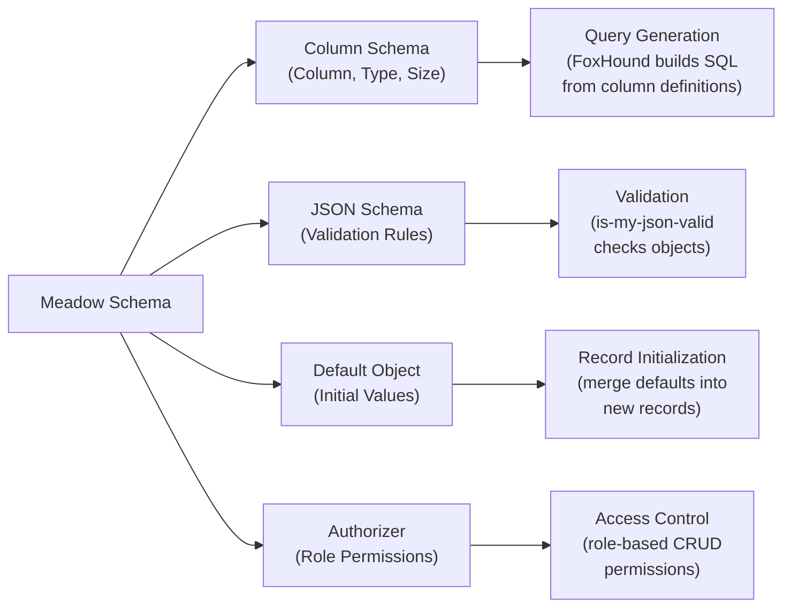
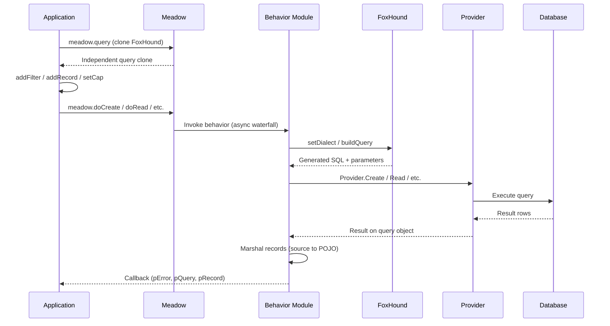

# Architecture

This document describes the internal architecture of Meadow, its component relationships, and how data flows through the system during CRUD operations.

## Module Hierarchy

Meadow sits between your application and the database, orchestrating schema management, query generation, behavior execution, and data marshalling.



## CRUD Behavior Flow

Every CRUD operation follows the same general flow: a query object enters a behavior module, which orchestrates provider calls, marshals results, and returns data through the callback.



## Create Waterfall

The create behavior is the most involved operation, performing multiple steps in an async waterfall to ensure GUID uniqueness and return the complete created record.



## Provider Architecture

Every provider implements the same interface. Meadow ships with providers for multiple database engines, plus a `None` provider for testing and a `MeadowEndpoints` provider for proxying to remote REST APIs.



## Schema System

The schema drives query generation, validation, record initialization, and access control. A single schema definition feeds multiple subsystems.



## Query Lifecycle

This diagram shows the full sequence of a CRUD operation from the application through to the database and back.



## Key Architectural Concepts

### Factory Pattern

Meadow uses a factory pattern for instantiation. When you `require('meadow')`, the module returns a constructor object. Calling `.new()` without a Fable instance returns a bare constructor. Calling `.new(pFable, pScope)` with a valid Fable instance returns a fully initialized Meadow DAL:

```javascript
var libMeadow = require('meadow');

// Returns a constructor (no Fable passed)
var tmpConstructor = libMeadow.new();

// Returns a fully initialized Meadow instance
var tmpBookDAL = libMeadow.new(_Fable, 'Book');
```

This same pattern is used throughout the Retold ecosystem in providers, schemas, and raw query objects.

### Behavior Modules

Each CRUD operation is encapsulated in its own behavior module under `source/behaviors/`. Behaviors use `async/waterfall` to sequence multi-step operations:

- **Meadow-Create.js** -- GUID check, insert, read back, marshal (4 steps)
- **Meadow-Read.js** -- read, marshal (2 steps)
- **Meadow-Reads.js** -- read, marshal each record, profile timing (2 steps)
- **Meadow-Update.js** -- validate, update, read back, marshal (4 steps)
- **Meadow-Delete.js** -- delete or soft-delete (1 step)
- **Meadow-Undelete.js** -- restore soft-deleted record (1 step)
- **Meadow-Count.js** -- count, validate result, profile timing (2 steps)

Each behavior receives the Meadow instance, a query object, and a callback. Errors at any waterfall step short-circuit to the final callback.

### Provider Interface

Every provider must implement six methods plus a marshaller:

| Method | Purpose |
|--------|---------|
| `Create(pQuery, fCallback)` | Insert a new record |
| `Read(pQuery, fCallback)` | Read one or more records |
| `Update(pQuery, fCallback)` | Update an existing record |
| `Delete(pQuery, fCallback)` | Delete (or soft-delete) a record |
| `Undelete(pQuery, fCallback)` | Restore a soft-deleted record |
| `Count(pQuery, fCallback)` | Count matching records |
| `marshalRecordFromSourceToObject(pObject, pRecord)` | Copy database row data into a JavaScript object |

Providers that need schema information also implement `setSchema(pScope, pSchema, pDefaultIdentifier, pDefaultGUIdentifier)`, which Meadow calls automatically when the schema or scope changes.

### Query Cloning

Every access to `meadow.query` returns an independent clone of the internal FoxHound query object. This guarantees that configuring one query never leaks state into another:

```javascript
var tmpQuery1 = tmpBookDAL.query.addFilter('Author', 'Asimov');
var tmpQuery2 = tmpBookDAL.query.addFilter('Author', 'Herbert');
// tmpQuery1 and tmpQuery2 are completely independent
```

The clone copies filters, caps, begin offsets, data elements, and sort configuration. The schema reference is set on each clone so that FoxHound has access to column type information for query generation.

### Auto-Stamping

When the schema includes special column types, Meadow automatically populates them during create, update, and delete operations:

| Column Type | Stamped During | Value |
|------------|----------------|-------|
| `CreateDate` | Create | Current timestamp (`NOW()`) |
| `CreateIDUser` | Create | Current user ID |
| `UpdateDate` | Update | Current timestamp (`NOW()`) |
| `UpdateIDUser` | Update | Current user ID |
| `DeleteDate` | Delete | Current timestamp (`NOW()`) |
| `DeleteIDUser` | Delete | Current user ID |
| `AutoIdentity` | Create | Auto-increment value from database |
| `AutoGUID` | Create | Generated UUID |

User identity comes from `meadow.setIDUser(n)` or from `pQuery.query.IDUser` on a per-query basis. Auto-stamping can be disabled per query with `disableAutoDateStamp` and `disableAutoUserStamp`.

### Soft Delete Filtering

When a schema contains a column with type `'Deleted'`, Meadow and FoxHound automatically add `WHERE Deleted = 0` to all read queries. This filters out logically deleted records without any additional code. To see deleted records, set `setDisableDeleteTracking(true)` on the query. See the [Soft Deletes](soft-deletes.md) documentation for details.
