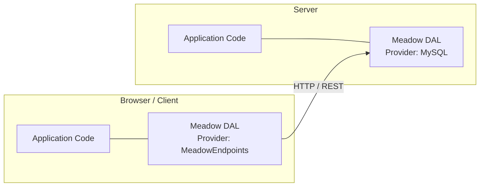

# MeadowEndpoints Provider

> HTTP proxy to remote Meadow REST APIs using the same Meadow interface

The MeadowEndpoints provider enables client-side JavaScript to use the same Meadow CRUD interface while delegating actual data operations to a remote Meadow REST API server. Instead of connecting to a database directly, it translates Meadow operations into HTTP requests using [simple-get](https://github.com/feross/simple-get). No external connection module is required -- the HTTP transport is built in.

## Setup

### Install Dependencies

```bash
npm install meadow
```

No external connection module is needed. The MeadowEndpoints provider uses `simple-get` (bundled with Meadow) for HTTP communication.

### Configure the Remote Server

```javascript
const libFable = require('fable').new(
	{
		MeadowEndpoints:
		{
			ServerProtocol: 'http',
			ServerAddress: '127.0.0.1',
			ServerPort: 8086,
			ServerEndpointPrefix: '1.0/'
		}
	});
```

### Create a Meadow DAL

```javascript
const libMeadow = require('meadow');

const meadow = libMeadow.new(libFable, 'Book')
	.setProvider('MeadowEndpoints')
	.setDefaultIdentifier('IDBook')
	.setSchema([
		{ Column: 'IDBook', Type: 'AutoIdentity' },
		{ Column: 'GUIDBook', Type: 'AutoGUID' },
		{ Column: 'Title', Type: 'String', Size: '255' },
		{ Column: 'Author', Type: 'String', Size: '128' },
		{ Column: 'CreateDate', Type: 'CreateDate' },
		{ Column: 'CreatingIDUser', Type: 'CreateIDUser' },
		{ Column: 'UpdateDate', Type: 'UpdateDate' },
		{ Column: 'UpdatingIDUser', Type: 'UpdateIDUser' },
		{ Column: 'DeleteDate', Type: 'DeleteDate' },
		{ Column: 'DeletingIDUser', Type: 'DeleteIDUser' },
		{ Column: 'Deleted', Type: 'Deleted' }
	]);
```

## Connection Configuration

| Setting | Type | Default | Description |
|---------|------|---------|-------------|
| `MeadowEndpoints.ServerProtocol` | string | -- | HTTP protocol (`'http'` or `'https'`) |
| `MeadowEndpoints.ServerAddress` | string | -- | Remote server hostname or IP address |
| `MeadowEndpoints.ServerPort` | number | -- | Remote server port |
| `MeadowEndpoints.ServerEndpointPrefix` | string | -- | URL path prefix for API endpoints (e.g., `'1.0/'`) |

### URL Construction

The provider constructs endpoint URLs from the configuration settings:

```
{ServerProtocol}://{ServerAddress}:{ServerPort}/{ServerEndpointPrefix}{Scope}/{Operation}
```

For example, with the default configuration and a `Book` scope:

```
http://127.0.0.1:8086/1.0/Book
http://127.0.0.1:8086/1.0/Books
http://127.0.0.1:8086/1.0/Book/42
http://127.0.0.1:8086/1.0/Books/Count
```

## HTTP Method Mapping

Each Meadow CRUD operation maps to a standard HTTP method:

| HTTP Method | Meadow Operation | Endpoint Pattern |
|-------------|------------------|------------------|
| `POST` | Create | `/{prefix}{Scope}` |
| `GET` | Read | `/{prefix}{Scope}/{ID}` |
| `GET` | Reads | `/{prefix}{Scope}s` |
| `GET` | Count | `/{prefix}{Scope}s/Count` |
| `PUT` | Update | `/{prefix}{Scope}` |
| `DELETE` | Delete | `/{prefix}{Scope}/{ID}` |

This mapping follows the standard Meadow REST conventions generated by [meadow-endpoints](https://github.com/stevenvelozo/meadow-endpoints) on the server side.

## Cookie and Header Forwarding

The MeadowEndpoints provider forwards cookies and headers from the client to the remote server. This enables transparent authentication and session management -- if the client has an authenticated session with the server, the provider carries those credentials through on every request.

## CRUD Operations

### Create

Sends a POST request with the record data as the JSON body.

```javascript
meadow.doCreate(
	meadow.query.addRecord({ Title: 'Dune', Author: 'Frank Herbert' }),
	(pError, pCreateQuery, pReadQuery, pRecord) =>
	{
		console.log('New ID:', pRecord.IDBook);
	});
```

**HTTP request:**
```
POST http://127.0.0.1:8086/1.0/Book
Content-Type: application/json

{ "Title": "Dune", "Author": "Frank Herbert" }
```

### Read

Sends a GET request to retrieve a single record by identifier.

```javascript
meadow.doRead(
	meadow.query.addFilter('IDBook', 42),
	(pError, pQuery, pRecord) =>
	{
		console.log('Title:', pRecord.Title);
	});
```

**HTTP request:**
```
GET http://127.0.0.1:8086/1.0/Book/42
```

### Reads

Sends a GET request to retrieve multiple records with optional filtering and pagination.

```javascript
meadow.doReads(
	meadow.query.setCap(25).setBegin(0),
	(pError, pQuery, pRecords) =>
	{
		pRecords.forEach((pBook) => console.log(pBook.Title));
	});
```

**HTTP request:**
```
GET http://127.0.0.1:8086/1.0/Books
```

### Update

Sends a PUT request with the updated record data as the JSON body.

```javascript
meadow.doUpdate(
	meadow.query
		.addFilter('IDBook', 42)
		.addRecord({ Title: 'Updated Title' }),
	(pError, pUpdateQuery, pReadQuery, pRecord) =>
	{
		console.log('Updated:', pRecord.Title);
	});
```

**HTTP request:**
```
PUT http://127.0.0.1:8086/1.0/Book
Content-Type: application/json

{ "IDBook": 42, "Title": "Updated Title" }
```

### Delete

Sends a DELETE request to soft-delete a record by identifier.

```javascript
meadow.doDelete(
	meadow.query.addFilter('IDBook', 42),
	(pError, pQuery, pResult) =>
	{
		console.log('Deleted:', pResult);
	});
```

**HTTP request:**
```
DELETE http://127.0.0.1:8086/1.0/Book/42
```

### Count

Sends a GET request to the count endpoint.

```javascript
meadow.doCount(
	meadow.query,
	(pError, pQuery, pCount) =>
	{
		console.log('Total books:', pCount);
	});
```

**HTTP request:**
```
GET http://127.0.0.1:8086/1.0/Books/Count
```

## Use Case: Unified Client-Server Interface

The primary use case for MeadowEndpoints is enabling client-side JavaScript to use the same Meadow data access interface that the server uses. This means your application logic can be written once and run in either context:



- **Server side:** Meadow uses a database provider (MySQL, MSSQL, PostgreSQL, etc.) to interact with the database directly
- **Client side:** Meadow uses MeadowEndpoints to proxy the same operations over HTTP to the server's REST API
- **Application code:** Identical CRUD calls in both environments

This pattern is especially powerful when combined with [meadow-endpoints](https://github.com/stevenvelozo/meadow-endpoints) on the server, which auto-generates REST routes from Meadow entity definitions.

## Full Setup Example

A complete working example showing client-side Meadow proxying to a remote server:

```javascript
const libFable = require('fable').new(
	{
		MeadowEndpoints:
		{
			ServerProtocol: 'https',
			ServerAddress: 'api.example.com',
			ServerPort: 443,
			ServerEndpointPrefix: '1.0/'
		}
	});

const libMeadow = require('meadow');

// Create the DAL with MeadowEndpoints provider
const meadow = libMeadow.new(libFable, 'Book')
	.setProvider('MeadowEndpoints')
	.setDefaultIdentifier('IDBook')
	.setSchema([
		{ Column: 'IDBook', Type: 'AutoIdentity' },
		{ Column: 'GUIDBook', Type: 'AutoGUID' },
		{ Column: 'Title', Type: 'String', Size: '255' },
		{ Column: 'Author', Type: 'String', Size: '128' },
		{ Column: 'CreateDate', Type: 'CreateDate' },
		{ Column: 'CreatingIDUser', Type: 'CreateIDUser' },
		{ Column: 'UpdateDate', Type: 'UpdateDate' },
		{ Column: 'UpdatingIDUser', Type: 'UpdateIDUser' },
		{ Column: 'DeleteDate', Type: 'DeleteDate' },
		{ Column: 'DeletingIDUser', Type: 'DeleteIDUser' },
		{ Column: 'Deleted', Type: 'Deleted' }
	]);

// These calls transparently proxy to the remote server
meadow.doCreate(
	meadow.query.addRecord({ Title: 'Dune', Author: 'Frank Herbert' }),
	(pError, pCreateQuery, pReadQuery, pRecord) =>
	{
		console.log('Created book with ID:', pRecord.IDBook);

		// Read it back from the server
		meadow.doRead(
			meadow.query.addFilter('IDBook', pRecord.IDBook),
			(pError, pQuery, pRecord) =>
			{
				console.log('Read back:', pRecord.Title, 'by', pRecord.Author);
			});
	});
```

## Error Handling

HTTP-related errors follow the standard pattern:

- Network errors (connection refused, timeouts) are returned as `pError` in the callback
- HTTP error status codes (4xx, 5xx) are stored in `pQuery.parameters.result.error`
- Response parsing failures are logged and reported through the error callback

## Related Documentation

- [Providers Overview](providers/README.md) -- Comparison of all providers
- [MySQL Provider](providers/mysql.md) -- Server-side database provider
- [ALASQL Provider](providers/alasql.md) -- Client-side in-memory alternative
- [meadow-endpoints](https://github.com/stevenvelozo/meadow-endpoints) -- Server-side REST API generation
